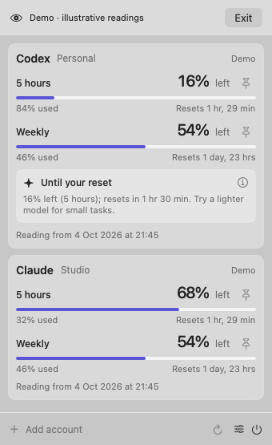

# ry Usage Bar

A little more headroom. A native macOS menu-bar app for seeing your AI quota, its next reset, and a useful suggestion when you’re running low.

**0.1.3 · development preview.** Original implementation using Ryan’s supplied ry.cool design system. [Download the universal preview](https://github.com/imstoz/ry-usage-bar/releases/tag/v0.1.3). It is not Developer ID signed or notarised; macOS may prevent it from opening. This preview is for early testing. Live Codex and Claude connectors are implemented; real-account acceptance testing is still required before a public release. Grok and Kimi are planned. There is no automatic updater in this version.



## What it does

- Shows remaining and used quota together, with reset times and the age of the reading.
- Keeps every Codex quota bucket separate, including buckets with equal window lengths.
- Shows Claude session, weekly and model-specific windows when returned.
- Pins one window’s remaining percentage to the menu bar.
- Offers a brief “Until your reset” suggestion at 80% usage, only while the reading is current. It never promises an unsupported saving or changes your model.
- Keeps the last successful reading after a failure, explicitly labelled for refresh. Missing usage is shown as unavailable.
- Supports multiple named CLI homes, system light/dark appearance, keyboard refresh, demo readings and opening at login.
- Uses no ry cloud service, app analytics or downloaded fonts.

## Build and open

Requires **macOS 13+**, Apple Silicon or Intel, and Xcode command line tools with Swift 5.9 or later. On a Mac without those tools, install them with `xcode-select --install`.

From the repository root (use `./scripts/test-core.sh` if your command line tools omit XCTest):

```sh
swift test
./scripts/build.sh
open "dist/ry Usage Bar.app"
```

The build creates an app for the current Mac architecture with a local development signature. Look for **ry** in the top-right menu bar; there is no Dock icon. Click it, then **Connect an account**. Choose **Take a look around** for a clearly labelled demo without signing in.

To keep a local build, copy `dist/ry Usage Bar.app` into Applications using Finder. Opening at login requires an installed app bundle; macOS may request approval in System Settings → General → Login Items. Local builds are not Developer ID signed or notarised. For a universal development package use `./scripts/package-preview.sh`; for the signed release process see `docs/releasing.md`.

## Sign in

1. Click **Add account**, choose Codex or Claude and give the account a name.
2. Click **Sign in**. A small sign-in window stays open while you complete the provider’s login in your browser.
3. Finish the provider’s authentication. Usage Bar adds the account and reads its quota after the login completes.

Codex uses the official app-server browser login and an isolated CLI home beneath Usage Bar’s local application-support folder. It does not replace your existing Codex login. Claude uses `claude auth login`, which updates the default Claude Code login on this Mac; that effect is stated in the account form. If Claude returns a code rather than completing its callback, paste the code into the sign-in window. A recent Claude Code CLI is required. The app finds common CLI locations and Claude Desktop’s downloaded native Code helper automatically; use **Advanced → Choose executable…** for another installation. There is no need to type tokens or run login commands yourself.

The browser is your normal browser, with the provider’s own login page. Usage Bar does not embed a password form or receive your password. The provider CLI handles OAuth and credential storage. If automatic opening fails, use **Open sign-in page** in the sign-in window. Cancel stops the login process; attempts time out after ten minutes. You still need the provider’s CLI or a supported Codex desktop executable installed.

Under **Advanced**, you can connect an existing CLI login instead, with its home folder. Codex API-key-only accounts may not return subscription limits. Claude’s provider-controlled usage endpoint is not a guaranteed public API. Expired Claude logins can be renewed by signing in again. Custom Claude Keychain-only homes are not supported yet. Adding the same provider/home updates its account entry rather than treating one shared login as two independent accounts.

## Everyday use

Click a pin beside a quota window to show its remaining percentage in the menu bar. The menu bar shows a four-part meter and the percentage remaining. A pinned window takes priority; otherwise it shows the first available window. A stale or failed reading displays a dim meter and `—`. Press **⌘R** while the panel is open to refresh. Requests are coalesced per account and manual attempts are separated by at least ten seconds. Usage refreshes every five minutes and after wake. Quota resets are not inferred: when the timestamp passes, the app asks for a new reading.

The advice is a simple rule, not an AI service: at least 80% used, a successful reading less than ten minutes old, and no reset timestamp already passed. It suggests lighter settings for simple tasks and deferring heavier work. It cannot calculate percentage savings, guarantee a model’s availability or assume model switching escapes a shared quota.

## Privacy and storage

Account names, home paths, quota snapshots and isolated Codex login homes live in `~/Library/Application Support/cool.ry.UsageBar/`. Menu-bar pin preferences live in macOS preferences. Credential contents are never copied or printed by Usage Bar. The official Codex subprocess saves its isolated login credentials under the selected login home. Claude tokens exist briefly in memory; requests go to Anthropic over HTTPS and redirects are rejected. Codex credentials stay under the official CLI’s management. Removing an account clears its quota cache and account entry, leaving the provider login untouched.

## Troubleshooting

| Symptom | What to try |
| --- | --- |
| No window after opening | Look for `ry` in the menu bar; this app has no Dock window. |
| Executable missing | Select the actual `codex` binary, not a shell alias. |
| Codex cannot return usage | Check that the selected home is signed in with ChatGPT and update the CLI. |
| Claude sign-in error | Renew the login in Claude Code. |
| Keychain unavailable | Check the macOS access prompt or use the CLI-owned credential file. |
| Reset passed | Refresh; the previous usage will remain visible until the provider confirms a new reading. |
| Needs refresh | Hover reset text for the exact local date; check the message beneath the account. |
| Open at login fails | Move the app into Applications and approve it in Login Items. |

## Repository

`Sources/UsageCore` holds quota parsing, freshness and advice. `Sources/UsageBar` holds native UI, local state and connectors. `Tests/UsageCoreTests` verifies semantic edge cases. `design/` preserves the supplied design authority. `docs/` covers the research, architecture, release procedure and acceptance checklist. `scripts/` builds app and distribution bundles. GitHub Actions runs tests and an app build; issue forms ask for redacted reproductions.

See [research](docs/research.md), [architecture](docs/architecture.md), [release instructions](docs/releasing.md), [acceptance checklist](docs/acceptance.md), [contributing](CONTRIBUTING.md) and [security](SECURITY.md).

## Credits

Concept inspired by [John Kueh’s Usage Bar](https://johnkueh.com/projects/usage-bar). This implementation and interface were written independently; no reference-project source was copied. Ryan’s supplied design snapshot dated 4 October 2026 is the design authority. MIT licence.
